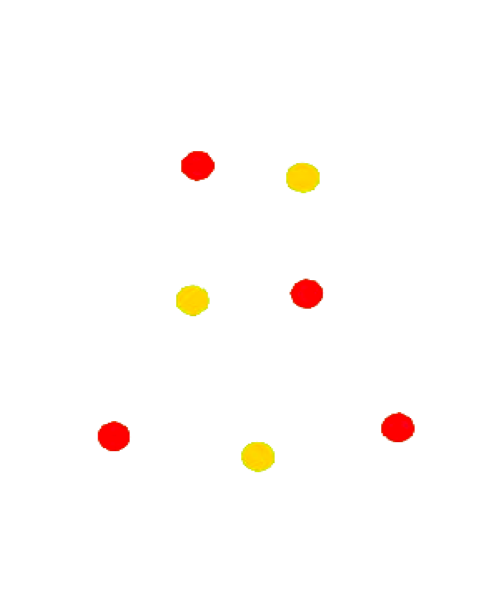

# Compiladores
<!DOCTYPE html>
<html lang="en">
  <head>
    <meta charset="UTF-8" />
    <meta http-equiv="X-UA-Compatible" content="IE=edge" />
    <meta name="viewport" content="width=device-width, initial-scale=1.0" />
    <title>Christmas Tree</title>

    
  </head>
  <body>
    <input
      onchange="toggleImage('lightsImage')"
      checked
      type="checkbox"
      name="lights"
    />
    <label>Lights</label>
    <input
      onchange="toggleImage('starsImage')"
      checked
      type="checkbox"
      name="stars"
    />
    <label>Stars</label>
    <input
      onchange="toggleImage('snowmanImage')"
      checked
      type="checkbox"
      name="snowman"
    />
    <label>Snowman</label>
    <input
      onchange="toggleImage('frameworkImage')"
      checked
      type="checkbox"
      name="framework"
    />
    <label>Framework</label>
    <input
      onchange="toggleImage('topperImage')"
      checked
      type="checkbox"
      name="toopper"
    />
    <label>Topper</label>
     
    
    
    
    
    
    

    
  </body>
</html>
